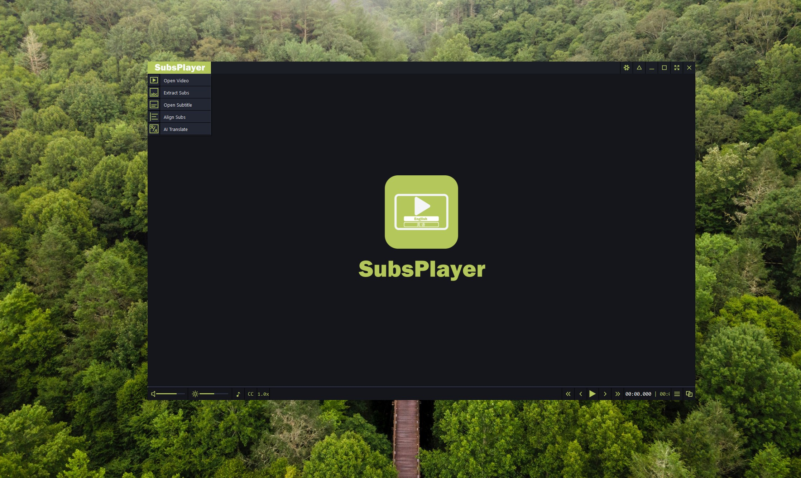
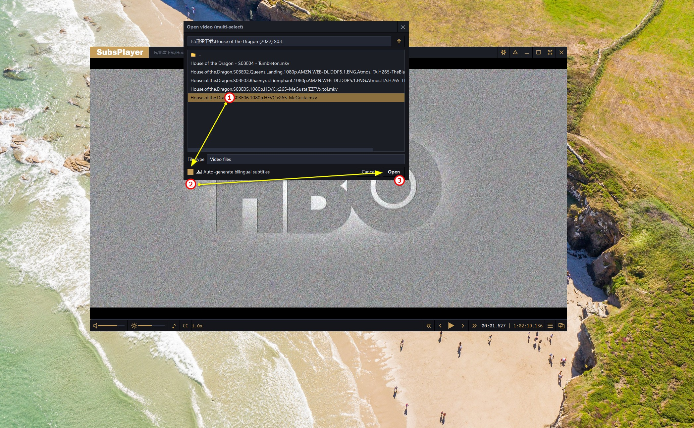
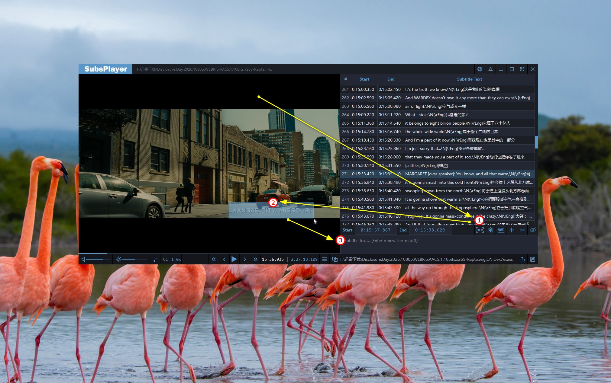
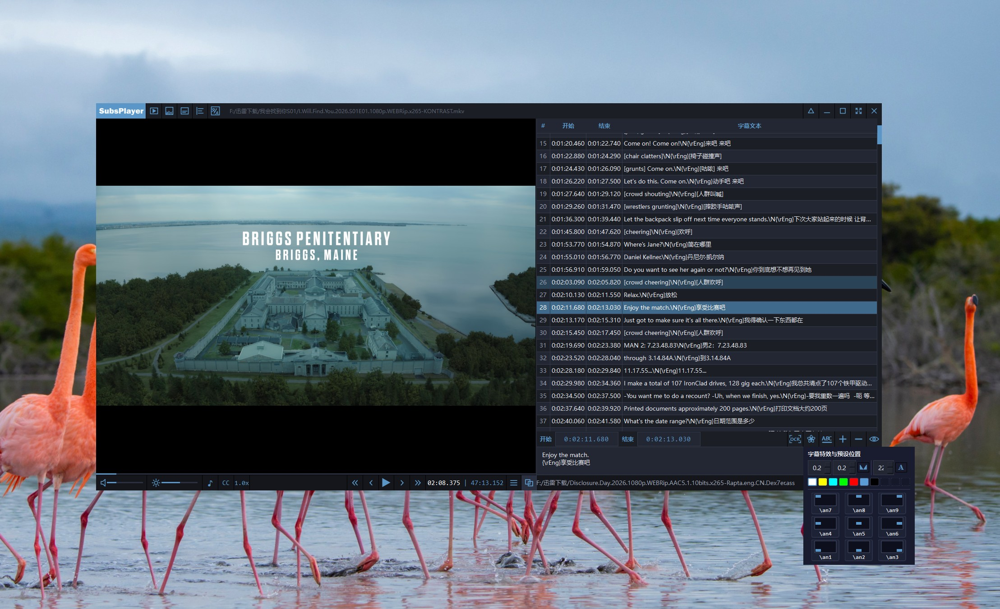

<p align="center">
  
</p>

<p align="center">
  
  
  
</p>

<p align="center">
<<<<<<< HEAD
  <a href="README.md">English</a> | 中文
</p>

SubsPlayer 不仅仅是一款 Windows 视频播放器，也是一款面向字幕工作者的字幕编辑器，打通了 **提取 → 对齐 → 翻译 → 编辑 → OCR 硬字幕 → 特效** 这一字幕编辑工作的全部流程，并且基于字幕制作的常见痛点做了针对性的功能优化设计
 
---

## 🖥 界面预览

### 纯播放器启动页



> 深色主题播放器首页：左侧为打开视频 / 提取字幕 / 打开字幕 / 对齐 / AI 翻译等入口，底部为音量、亮度、音轨、CC、倍速与播放控制

### 打开视频并启用自动生成双语字幕



> 打开视频时可勾选「自动生成双语字幕」，一键翻译双语字幕，追剧再也不用怕没有字幕了

### OCR 框选硬字幕



> ① 点击编辑区 **OCR** → ② 在画面上拖拽框选硬字幕区域 → ③ 识别并翻译，结果自动插入当前时点

### ASS 基本特效与位置预设



> 选中字幕行后，可用预设色板与 `\an1`–`\an9` 对齐格子快速写入样式与位置标签，支持淡入淡出，画面实时预览

---

## ✨ 核心特性

*   **字幕提取**
*   **自动化时间轴对齐**：可用当前视频音轨或已校对的参考字幕修正偏移与漂移
*   **AI 智能翻译引擎**
    *   现已支持Gemini REST API
    *   **断点续翻**：应对漏译、截断与中途中断
    *   **预清洗 + 自动术语表**：去掉角色名前缀与括号注释；提取人名地名等并保持译法一致
    *   **双语 ASS 输出**：可选单语 / 双语，以及原文、译文上下顺序
*   **可视化编辑器**
    *   **时间戳**任意数位**滚轮微调**，视频**实时跟跳**
    *   五种布局：纯播放器 / 编辑器在右 / 在左 / 播放器在上 / **双窗口分离**
*   **硬字幕 OCR + 基础 ASS 特效**：画面框选识别并翻译；预置颜色与九宫格对齐
*   **国际化界面**：中、英、日、韩、越、印尼、葡、西、法

---

## 🚀 安装与使用

*   通过SubsPlayer.com主页链接或者Release页下载exe安装运行即可

### 作为播放器

> **纯播放器模式 / 提取 / 对齐 / 手工编辑**，无需配置 API Key ，安装后可直接播放视频、加载外挂字幕，**无需**配置 API Key


## 字幕翻译与编辑推荐流程，需已配置 Key

1. **导入视频**：点击「打开视频」或拖入文件；可勾选「自动生成双语字幕」
2. **提取字幕**：对含内封字幕的视频，点击「提取字幕」，批量导出为外部 SRT
3. **时间对齐**：若音画不同步，点击「对齐字幕」，以当前音轨或参考 SRT 为基准对齐
4. **AI 翻译**：选中 SRT，点击「AI 翻译」，设定目标语言、双语、清洗与术语表；多 Key 会自动轮换
5. **可视化校对**：可一边播放一边改译文与时间轴；需要时对硬字幕使用 OCR 框选自动翻译填入，处理基本特效

---

## 🔑 Gemini API Key 获取与配置

> **AI 翻译、硬字幕 OCR、自动生成双语字幕**：必须配置可用的 Gemini API Key

### 一、在 Google AI Studio 申请 Key

1. 使用浏览器打开官方页面：  
   **[https://aistudio.google.com/apikey](https://aistudio.google.com/apikey)**  

2. 使用 Google 账号登录，并同意相关服务条款

3. 点击 **Create API key（创建 API 密钥）**：
   *   新手推荐：**Create API key in new project**（自动新建 Cloud 项目）
   *   若已有 Cloud 项目：选择 **Create API key in existing project**
   
4. 创建成功后，立刻复制整串密钥（通常以 `AIza` 开头）  
   请自行妥善保存；不要发到公开群聊、截图或提交到 Git 仓库  
   
5. （可选）若翻译量大，可用**多个 Google 账号**各申请一把 Key，在软件里多行粘贴，启用自动轮换以提高吞吐

> **免费额度与模型配额会随 Google 政策调整，请以官方说明为准：  
> **[Gemini API 文档](https://ai.google.dev/gemini-api/docs) · [配额与定价](https://ai.google.dev/gemini-api/docs/rate-limits)

### 二、在 SubsPlayer 中填入 Key

1. 启动 SubsPlayer，点击窗口右上角 **齿轮（设置）**

2. 打开 **「AI 翻译」** 选项卡（默认第一个）

3. 确认提供商为 **Gemini**，模型建议保持默认

4. 在 **API Keys** 多行文本框中粘贴密钥：
   *   **每行一个** Key
   *   不要加引号、逗号或 `Bearer` 等前缀
   *   多 Key 示例：
=======
  English | <a href="README_CN.md">中文</a>
</p>

SubsPlayer is not only a Windows video player, but also a subtitle editor built for subtitle workflows. It covers the full pipeline — **extract → align → translate → edit → hard-sub OCR → effects** — with features tuned for common pain points in bilingual subtitle production.

---

## 🖥 Screenshots

### Player home


> Dark-themed player home: Open Video / Extract Subs / Open Subtitle / Align / AI Translate on the left; volume, brightness, audio track, CC, speed and transport controls along the bottom.

### Open video & auto-generate bilingual subtitles


> When opening a video, enable **Auto-generate bilingual subtitles** to translate in one click — no more missing subs when binge-watching.

### Hard-sub OCR


> ① Click **OCR** in the editor → ② drag-select the burned-in text on the video → ③ recognize & translate, then insert at the current time.

### Basic ASS effects & position presets


> After selecting a line, use the color palette and `\an1`–`\an9` alignment grid to insert style/position tags; fade in/out supported, with live preview.

---

## ✨ Key Features

*   **Subtitle extraction**
*   **Automated timeline alignment** — fix offset/drift using the current video audio track or a known-good reference subtitle
*   **AI translation engine**
    *   Gemini REST API supported
    *   **Resume from breakpoint** — recover from omitted, truncated, or interrupted jobs
    *   **Pre-cleaning + auto glossary** — strip speaker prefixes and bracket noise; keep names/places consistent
    *   **Bilingual ASS output** — mono/bilingual, plus original/translation ordering
*   **Visual editor**
    *   Per-digit timestamp** tweaking with mouse wheel**; **video seeks** in sync
    *   Five layouts: player-only / editor right / left / video on top / **detached dual-window**
*   **Hard-sub OCR + basic ASS effects** — region select on video; color + 9-grid alignment presets
*   **Internationalized UI** — Chinese, English, Japanese, Korean, Vietnamese, Indonesian, Portuguese, Spanish, French

---

## 🚀 Install & Use

*   Download the installer from [SubsPlayer.com](https://SubsPlayer.com) or the GitHub Release page, then run the exe.

### As a player

> **Player-only mode / extract / align / manual edit** need no API key. After install you can play video and load external subs without configuring a key.

## Recommended subtitle translation & edit workflow (API key required)

1. **Import video** — Open Video or drag files in; optionally enable **Auto-generate bilingual subtitles**
2. **Extract subs** — for videos with embedded tracks, click Extract Subs and batch-export to external SRT
3. **Align timing** — if A/V is out of sync, Align Subs against the current audio track or a reference SRT
4. **AI Translate** — select the SRT, set target language / bilingual / cleaning / glossary; multiple keys rotate automatically
5. **Visual proofreading** — edit translation and timing while playing; use OCR on hard-subs when needed, plus basic effects

---

## 🔑 Gemini API Key — Obtain & Configure

> **AI Translate, hard-sub OCR, and auto-generate bilingual subtitles** require a valid Gemini API key.

### 1. Create a key in Google AI Studio

1. Open the official page:  
   **[https://aistudio.google.com/apikey](https://aistudio.google.com/apikey)**

2. Sign in with a Google account and accept the terms.

3. Click **Create API key**:
   *   Beginners: **Create API key in new project** (auto-creates a Cloud project)
   *   Or: **Create API key in existing project**

4. Copy the full key immediately (usually starts with `AIza`).  
   Keep it private — do not post it in public chats, screenshots, or git repos.

5. (Optional) For heavy workloads, create keys under **multiple Google accounts** and paste them one-per-line in the app for automatic rotation and higher throughput.

> **Free quotas and model limits change with Google policy — check official docs:**  
> **[Gemini API docs](https://ai.google.dev/gemini-api/docs) · [Rate limits / pricing](https://ai.google.dev/gemini-api/docs/rate-limits)**

### 2. Paste the key into SubsPlayer

1. Launch SubsPlayer → click the **gear (Settings)** at the top-right.

2. Open the **AI Translate** tab (first tab by default).

3. Confirm the provider is **Gemini**; keep the default model unless you know you need another.

4. In the **API Keys** box, paste keys:
   *   **One key per line**
   *   No quotes, commas, or `Bearer` prefixes
   *   Multi-key example:
>>>>>>> aa6a805 (update 1 public)
     ```text
     AIzaSyxxxxxxxxxxxxxxxxxxxxxxxxxxxxxxx1
     AIzaSyxxxxxxxxxxxxxxxxxxxxxxxxxxxxxxx2
     AIzaSyxxxxxxxxxxxxxxxxxxxxxxxxxxxxxxx3
     ```
<<<<<<< HEAD
     
5. 按需调整限流（默认一般可用）：
   *   **RPM（每分钟请求数）**：默认约 `14`，过大会更容易触发官方限流
   *   **RPD（每日请求数）**：默认较大；达到后当日任务会停止
   *   **每批行数**：控制单次请求字幕行数，过大可能截断，过小会变慢
   
6. 设置默认目标语言、是否双语、术语表等，点击 **保存**

### 三、网络与代理（国内用户尤其重要）

软件通过官方端点访问 Gemini：

`https://generativelanguage.googleapis.com/...`

*   若该地址无法直连，翻译与 OCR 会超时或失败请先保证本机可访问上述域名（系统代理 / 科学上网等）
*   SubsPlayer 会跟随系统代理设置；请先确认浏览器或系统代理已能打开 AI Studio，再在软件内重试
*   报错「缺少 API Key」：回到设置确认 Keys 非空且已点保存
*   报错 429 / 配额相关：降低 RPM、增加备用 Key，或稍后再试

---

## ⚙ 常见问题 (FAQ)

1. **提示缺少 API Key？**  
   打开 **设置 → AI 翻译**，按上文粘贴 Key 并保存OCR 与 AI 翻译共用同一组 Keys

2. **翻译很慢、一直失败，或 OCR 报错？**  
   先确认能访问 `generativelanguage.googleapis.com`；再检查 Key 是否有效、RPM 是否过高；可增加多把 Key 做轮换

3. **只有播放相关功能正常，AI 功能全部不可用？**  
   通常是未配置 Key，或网络到 Google API 不通，与播放内核无关

---

## 🙏 鸣谢

SubsPlayer 站在这些优秀开源项目与服务的肩膀上：

| 组件 | 作者 / 团队 | 主页 |
| :--- | :--------- | :--- |
| **FFmpeg** | FFmpeg team | https://ffmpeg.org |
| **FFmpeg Windows 构建** | Gyan Doshi | https://www.gyan.dev/ffmpeg/ |
=======

5. Tune rate limits if needed (defaults are usually fine):
   *   **RPM (requests/minute)** — default ~`14`; too high invites official throttling
   *   **RPD (requests/day)** — job stops for the day when reached
   *   **Batch lines** — lines per request; too large may truncate, too small slows down

6. Set default target language, bilingual options, glossary, etc., then **Save**.

### 3. Network & proxy (especially important in mainland China)

The app calls Gemini via the official endpoint:

`https://generativelanguage.googleapis.com/...`

*   If that host is unreachable, translate/OCR will time out or fail — ensure the machine can reach the domain (system proxy / VPN, etc.)
*   SubsPlayer follows the system proxy; confirm AI Studio loads in a browser first, then retry in-app
*   Error “Missing API Key”: reopen Settings, confirm keys are non-empty and saved
*   429 / quota errors: lower RPM, add spare keys, or retry later

---

## ⚙ FAQ

1. **Missing API Key?**  
   Open **Settings → AI Translate**, paste keys as above and Save. OCR and AI Translate share the same keys.

2. **Translate is slow / always fails, or OCR errors?**  
   First confirm access to `generativelanguage.googleapis.com`; then check key validity and RPM; add more keys for rotation if needed.

3. **Playback works, but all AI features fail?**  
   Usually missing keys or no route to Google’s API — unrelated to the player core.

---

## 🙏 Acknowledgements

SubsPlayer stands on the shoulders of these excellent open-source projects and services:

| Component | Author / Team | Homepage |
| :-------- | :------------ | :------- |
| **FFmpeg** | FFmpeg team | https://ffmpeg.org |
| **FFmpeg Windows builds** | Gyan Doshi | https://www.gyan.dev/ffmpeg/ |
>>>>>>> aa6a805 (update 1 public)
| **mpv / libmpv** | mpv-player team | https://mpv.io · https://github.com/mpv-player/mpv |
| **alass** | kaegi (Alana Sanchez) | https://github.com/kaegi/alass |
| **Qt / PySide6** | The Qt Company | https://doc.qt.io/qtforpython/ |
| **python-mpv** | jaseg | https://github.com/jaseg/python-mpv |
| **pysubs2** | Tomáš Karabela | https://github.com/tkarabela/pysubs2 |
| **Requests** | Kenneth Reitz & contributors | https://requests.readthedocs.io |
| **Google Gemini API** | Google | https://ai.google.dev |
<<<<<<< HEAD
| **Claude**（辅助开发） | Anthropic | https://claude.com |

---
## ✨What You Need to Know
=======
| **Claude** (dev assistant) | Anthropic | https://claude.com |

---

## ✨ What You Need to Know
>>>>>>> aa6a805 (update 1 public)

* All rights reserved by SubsPlayer.
* By downloading and using this software, you agree to share automatic translation results and subtitle files embedded in videos with other users. If you object to this, please do not use this software.
* Thank you to Google for providing the free API. This software will not share your API key; I have my own paid API.
* Commercial use is strictly prohibited.
* Please comply with local laws and regulations.
* Technology is innocent. Long live open source!
